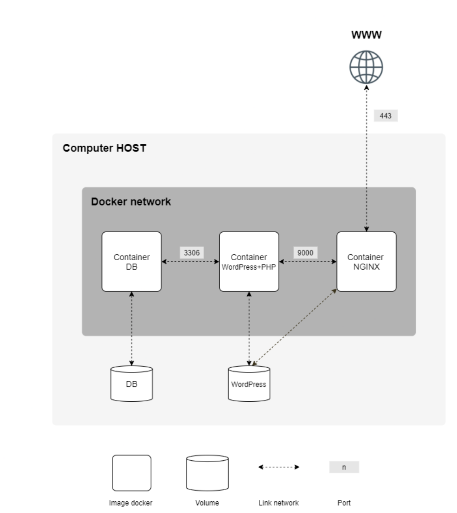

This project aims to broaden your knowledge of system administration by using Docker.
You will virtualize several Docker images, creating them in your new personal virtual
machine.

Each Docker image must have the same name as its corresponding service.
Each service has to run in a dedicated container.
For performance matters, the containers must be built either from the penultimate stable
version of Alpine or Debian. The choice is yours.
You also have to write your own Dockerfiles, one per service. The Dockerfiles must
be called in your docker-compose.yml by your Makefile.
It means you have to build yourself the Docker images of your project. It is then forbidden to pull ready-made Docker images, as well as using services such as DockerHub
(Alpine/Debian being excluded from this rule).

You then have to set up:
• A Docker container that contains NGINX with TLSv1.2 or TLSv1.3 only.
• A Docker container that contains WordPress + php-fpm (it must be installed and
configured) only without nginx.
• A Docker container that contains MariaDB only without nginx.
• A volume that contains your WordPress database.
• A second volume that contains your WordPress website files.
• A docker-network that establishes the connection between your containers.

